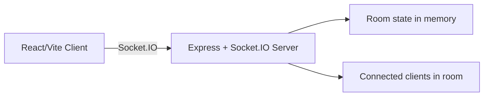

# ChatSocket

ChatSocket is a lightweight real-time chat application built with a React/Vite frontend and a Node.js/Express/Socket.IO backend. It allows users to join a chat room, send messages instantly, see who is online in the room, and receive typing indicators in real time.

The project is intentionally simple and serves as a good example of a real-time client/server application using WebSockets.

## 1. Project overview

### What the app does
ChatSocket lets multiple users join the same chat room and exchange messages live. The experience is centered around a single-room chat flow with a minimal interface:

- Enter a username and room name to join
- Send and receive messages instantly
- See other users currently in the room
- See when someone is typing
- Leave the room and rejoin as needed

### Intended audience
This project is suitable for:

- Developers learning real-time web applications
- Students exploring Socket.IO and React
- Small teams wanting a simple chat demo

### Core user experience
A user opens the app, enters a username and room, joins the room, and begins chatting. The backend handles room membership and broadcasts messages to all connected clients in that room.

## 2. Tech stack

### Frontend
- React 19
- Vite
- Socket.IO client
- CSS for styling

### Backend
- Node.js
- Express
- Socket.IO
- CORS middleware

### Runtime and tooling
- npm for package management
- Vite dev server for local frontend development

## 3. Key features

- Room-based chat: users join a named room and only receive messages from that room
- Real-time messaging: messages are broadcast immediately to all users in the same room
- Typing indicators: users can see when others are typing
- Room presence: the app lists users currently in the room
- Connection status: the UI shows whether the client is connected or reconnecting
- Reconnection support: the client is configured to reconnect automatically if the connection drops

## 4. Project structure

```text
chatsocket/
├── backend/
│   ├── index.js
│   └── package.json
├── frontend/
│   ├── index.html
│   ├── package.json
│   ├── vite.config.js
│   ├── public/
│   └── src/
│       ├── App.css
│       ├── App.jsx
│       ├── Chat.jsx
│       ├── index.css
│       ├── main.jsx
│       └── socket.js
└── README.md
```

### Main files

- [backend/index.js](backend/index.js): Contains the Express server, Socket.IO setup, room tracking logic, and event handlers.
- [frontend/src/Chat.jsx](frontend/src/Chat.jsx): Main chat UI and client-side socket event handling.
- [frontend/src/socket.js](frontend/src/socket.js): Creates and exports the Socket.IO client connection.
- [frontend/src/App.jsx](frontend/src/App.jsx): Renders the main application entry.
- [backend/package.json](backend/package.json): Backend dependencies and scripts.
- [frontend/package.json](frontend/package.json): Frontend dependencies and scripts.

## 5. Setup and installation

### Prerequisites
Make sure the following are installed on your machine:

- Node.js
- npm

### Install dependencies

#### Backend
```bash
cd backend
npm install
```

#### Frontend
```bash
cd frontend
npm install
```

### Start the application

#### Start the backend server
```bash
cd backend
node index.js
```

The backend listens on port 5000.

#### Start the frontend development server
```bash
cd frontend
npm run dev
```

The frontend runs by default on port 5173.

### Access the app
Open the following URL in your browser:

```text
http://localhost:5173
```

## 6. Architecture

The app follows a simple client-server architecture:



### How the frontend and backend communicate
The frontend connects to the backend using a single Socket.IO client instance created in [frontend/src/socket.js](frontend/src/socket.js). The client then emits events such as `joinRoom`, `sendMessage`, `typing`, and `leaveRoom`.

The backend listens for those events and broadcasts updates back to clients in the relevant room.

### Main application flow
1. The user opens the app and enters a username and room name.
2. The client sends a `joinRoom` event to the server.
3. The server adds the client to the room and notifies the room.
4. Messages sent by the client are broadcast to all users in that room.
5. Typing events are broadcast to show live activity.
6. Leaving the room removes the user from the room state and updates the room list.

## 7. Socket event flow

The backend uses the following main Socket.IO events:

| Event | Direction | Purpose |
| --- | --- | --- |
| `joinRoom` | Client → Server | Joins a room and stores the current username and room for the socket |
| `sendMessage` | Client → Server | Sends a chat message to all users in the room |
| `typing` | Client → Server | Announces whether the user is typing or has stopped typing |
| `leaveRoom` | Client → Server | Removes the socket from the current room |
| `receiveMessage` | Server → Client | Delivers a chat message to the room |
| `system` | Server → Client | Sends system notifications such as joins and leaves |
| `roomUsers` | Server → Client | Updates the list of users currently in the room |

### Event behavior summary
- `joinRoom` removes the socket from any previous room before joining the new one.
- `sendMessage` creates a message payload with an ID, content, username, and timestamp.
- `typing` sends presence information to other users in the room.
- `leaveRoom` and disconnect events both clean up room membership.

## 8. Frontend component and state overview

The main UI is implemented in [frontend/src/Chat.jsx](frontend/src/Chat.jsx).

### Main UI states
The component uses React state to manage:

- `username`: the current display name
- `room`: the active chat room
- `joined`: whether the user has joined a room
- `messages`: the conversation history shown in the chat window
- `newMsg`: the message currently being typed
- `roomUsers`: the list of users in the current room
- `typingUsers`: the set of users currently typing
- `connected`: the current socket connection state

### UI flow
1. The user enters a username and room on the join screen.
2. Submitting the form emits `joinRoom` and switches the UI to the chat view.
3. The message input sends messages and also emits typing status.
4. Leaving the room resets the current room state and returns the user to the join screen.

## 9. Backend behavior

The backend logic lives in [backend/index.js](backend/index.js).

### Room tracking
The server tracks rooms in memory using a `Map` structure:

- The key is the room name.
- The value is a `Map` of socket IDs to usernames.

This means the room membership is temporary and resets if the server restarts.

### User lifecycle handling
When a client joins a room:

- The server removes the client from any previous room
- The client joins the new Socket.IO room
- The user is added to the in-memory room map
- A system message is broadcast to the room
- The updated user list is broadcast back to the room

When a client leaves a room or disconnects:

- The user is removed from the room map
- The room is deleted if no users remain
- Notification messages are sent to the remaining users

### Important note
The app does not currently persist messages, users, or rooms to a database. All state is kept in memory while the server is running.

## 10. Configuration and environment

### Backend configuration
The backend currently uses a small hard-coded CORS configuration:

- `http://localhost:5173`
- `http://127.0.0.1:5173`

These values match the default Vite development origin.

### Default ports
- Frontend dev server: 5173
- Backend server: 5000

### Assumptions
- The frontend is expected to run on the default Vite port.
- The backend is expected to be reachable at `http://localhost:5000`.
- No environment variables are currently used for configuration.

## 11. Troubleshooting

### Backend not connecting
- Make sure the backend server is running on port 5000.
- Confirm the frontend is pointing to the correct Socket.IO server URL in [frontend/src/socket.js](frontend/src/socket.js).

### CORS errors
- Verify that the frontend origin is included in the backend CORS allowlist in [backend/index.js](backend/index.js).
- If you change the frontend port, update the backend configuration accordingly.

### Unable to join a room
- Ensure both a username and room name are provided.
- Check the browser console and terminal output for socket errors.

### Frontend build issues
- Reinstall dependencies if packages are missing.
- Run `npm install` in both the frontend and backend folders.

### No tests configured
The current package manifests do not define an automated test suite, so verification is mostly manual through local running and browser interaction.

## 12. Limitations and future improvements

The current project is a solid demo, but it has some limitations:

- No persistent storage for messages or room history
- No authentication or user accounts
- No private messaging or direct chats
- No moderation tools or room management
- No database integration
- No deployment configuration included

### Potential enhancements
- Add a database to persist chat history
- Support authentication and user profiles
- Add private rooms and direct messages
- Implement message timestamps and better chat formatting
- Add notifications, unread counts, and user avatars
- Add automated tests and CI/CD

## Summary
ChatSocket is a simple but effective real-time chat application that demonstrates the core ideas behind modern WebSocket-based messaging. It is easy to run locally, easy to understand, and a good starting point for extending into a more complete chat product.
